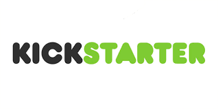
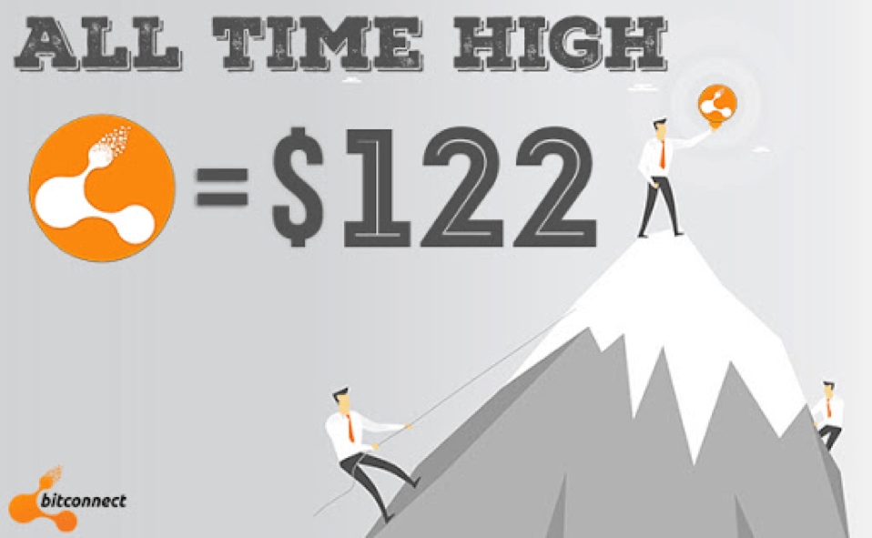
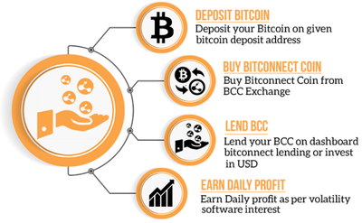
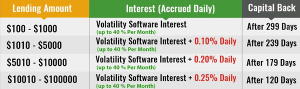
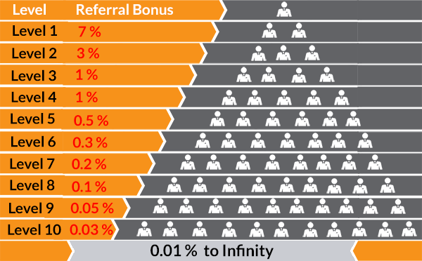

# ICO

## Qu'est ce qu'une ICO?

  

Une ICO (Initial Coin Offering) est une méthode de levée de fonds, fonctionnant via l’émission de tokens échangeables contre des cryptomonnaies ou du fiat monnaie décreté par un état tel que l'euro ou le dollar) durant la phase de démarrage d’un projet.

  

## Différence entre le crowfunding et l'ICO

Le crowfunding est un moyen pour les gens, un groupe ou une entreprise d'obtenir des fonds du public sans passer par une banque comme mediateur. Il est plus facile parfois d'utiliser cette méthode plutôt que de passer par une banque pour un emprunt.

### 1.Les plateformes

  

Le crowdfunding passe en général par des plateformes tels que Kickstarter ou Gofundme.
Une Ico n'est pas lié à une plateforme spécifique. Il n'y a donc pas de médiateur pour une Ico.
On aura plus donc pour avantage pour le crowfunding traditionnel une plus grande confiance car si la target de la somme requise n'est pas atteinte, un remboursement garanti en général par la plateforme. Pour l'ico, ça susite plus de mefiance car l'argent est directement envoyé à l'entreprise derrière l'ICO et non via une plateforme. L'avantage c'est qu'il n'y aura pas de frais pour l'entreprise.

### 2.La régularisation

Le crowdfunding est régularisé par les gouvernements. Il ya donc un contrôle du gouvernement aux USA. Et en France notamment.
Pour les ICO, il n'y a pour le moment pas de contrôle du gouvernement là dessus. Donc le risque est assez elevé pour perdre l'argent investi dans des faux projets ou autres fraudes.

### 3. Vision du projet

Pour le crowdfunding, on présente en général un prototype du projet en développement. L'ICO pas forcément.
Elle va plutôt présenter un projet qui n'est pas encore concrétiser. Les investisseurs auront tendance à être prudent.
Mais l'avantage, c'est que ça permet de lancer pas mal de startups.

### 4. Contributions/Récompenses

Pour le crowfunding, selon le montant investi. On aura en général un simple merci en passant par une copie du produit final voir plus.
Pour les ICO, on reçoit des tokens (jetons). Dans un premier temps, les tokens sont émis par l’organisation à l’origine de l’ICO, et peuvent être acquis par quiconque lors de l’ICO en échange de cryptomonnaie (le plus souvent, de l’ether ou du bitcoin) ou du fiat.

## Token

Les tokens ne représentent pas des parts de l’entreprise, à la différence d’actions. Acheter des tokens lors d’une ICO revient en fait à pré-payer le produit ou le service appelé à être développé.
Après la phase de distribution des tokens aux investisseurs, ces tokens sont vendables sur des plateformes d'échange à un taux dépendant
de l'offre et la demande. Ces tokens ont pour vocation à être utilisable dans le projet financé par l'ICO en question. Au plus le projet est intéressant aux plus la valeur du token augmentera.

## Bon Exemple

Storj, un service de stockage cloud décentralisé, a levé début 2017 l’équivalent de 30 millions de dollars via une ICO. Leur token, appelé Storjcoin, permet d’acheter de l’espace de stockage sur le réseau Storj, et inversement, de louer l’espace libre de votre ordinateur sur le réseau Storj en échange de Storjcoin. Si vous achetez ou obtenez des Storjcoin, vous pouvez ensuite soit acheter de l’espace sur le réseau, soit les garder dans une perspective de spéculation, soit les convertir dans votre monnaie nationale.

## Bitconnect

BitConnect était une obscure plateforme qui promettait  : une rente fixe grâce aux crypto-monnaies. Aujourd'hui, la chaîne de Ponzi du système BitConnect se dévoile, laissant des gagnants, et de nombreux perdants. La plateforme promettait un rendement de 480% par an.

### Fonctionnement

Vous achetez des Bitcoins avec ces Bitcoins, vous achetez des tokens BitConnect (vous pouvez le faire sur plusieurs plateformes, mais plus de 90% des échanges s’effectuent sur leur plateforme bitconnect.co ).
Vous bloquez vos jetons BitConnect entre 120 et 299 jours (en fonction du montant investi). Ce placement s’effectue uniquement sur leur plateforme bitconnect.co. Précision importante : vous bloquez la valeur de vos BitConnect en dollars et non en jetons BitConnect.

  
  

Bitconnect avec une capitalisation de 2,5 milliards est une pure escroquerie.
Cela fonctionnait avec un système de parrainage. Donc au plus tu affilies des gens dans le projet, aux plus tu touches des intérêts.
Une arnaque pyramidale en gros.

Ils n’ont jamais fait de marketing à proprement parler. Ils n’en ont pas eu besoin puisqu’ils avaient ce système de parrainage et d’affiliation qui a poussé des youtubers et twittos à conseiller le BitConnect aux débutants pour toucher leur commission.
L’entreprise, immatriculée au Vietnam, sera difficile à poursuivre pour les victimes et bien sûr les créateurs ont disparus avec une bonne partie de l'argent.

Voici un exemple de témoignage:«  Il ne me reste plus rien. J’ai mis tout ce que j’avais dessus, car je leur faisais confiance. Littéralement, toutes les économies de ma famille sont en BCC parce qu’un ami m’a dit que le risque en valait la peine. Êtes-vous en train de me dire que j’ai tout perdu ? 80 000 $ ont disparu ? Je suis tellement en colère. Ma femme ne sait rien encore, elle arrive à la maison bientôt. Qu’est-ce que je suis censé lui dire ?  »

« Ne prends pas les gens pour des cons, mais n’oublie pas qu’ils le sont  ».
